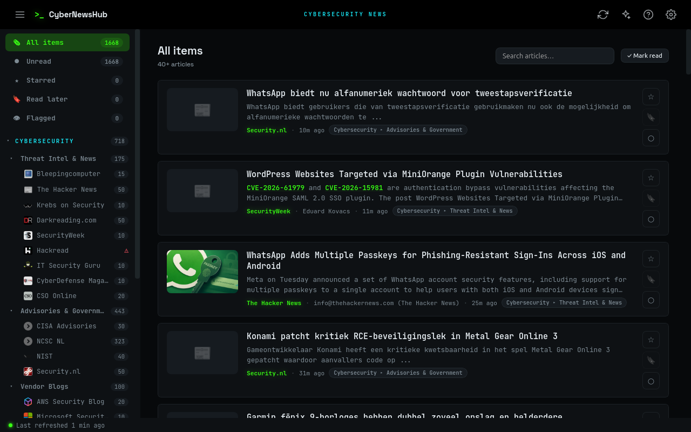

# CyberNewsHub



> ⚠️ **Disclaimer:** This is a Claude Code "vibe coding" project. It was built
> iteratively with the [Claude Code](https://claude.com/claude-code) AI agent
> and is intended for personal/experimental use. Review the code before relying
> on it.

A self-hosted, dark-mode **news aggregator** for the things you read and watch every
day — cybersecurity and AI articles, RSS/Atom feeds, and YouTube channels — all in one
browser dashboard, organised **by category and subject**. It's the web/Docker companion
to the [CTN](../ctn) terminal reader, sharing the MyHours app's look and feel.

## What it does

- **One inbox for three source types**
  - **RSS / Atom** feeds.
  - **YouTube** channels & playlists — paste a channel, `@handle`, video or playlist URL
    and CyberNewsHub resolves it to the channel's video feed (thumbnails included). No API key.
    **Shorts are auto-detected and hidden** (toggle in ⚙ settings).
  - **Websites without a feed** — paste the page URL and it auto-discovers the site's
    hidden RSS/Atom `<link>`.
- **Category → Subject → Feed** tree in the sidebar, mirroring MyHours' navigation.
- **Read / unread** tracking, **★ starred** items (kept forever), per-view *Mark read*,
  full-text search, and quick filters for *All / Unread / Starred*.
- **Background refresh** every `REFRESH_MINUTES` (default 30), plus a manual **Refresh**
  button. Articles are cached in SQLite, so the page loads instantly and works offline.
- **OPML import/export** — bundled with 23 cybersecurity/AI/tech feeds, grouped on first run.

## Run it

```bash
docker compose up -d --build
# → http://localhost:8030
```

Data (the SQLite DB) lives in a Docker volume, so it survives rebuilds. The volume is
declared as `ctnhub-data` in `docker-compose.yml`; Compose prefixes it with the project
directory name, so the **actual volume is `cybernewsreader_ctnhub-data`** (the name you
use for backups — see below).

## Configuration

| Env var             | Default | Meaning                                              |
|---------------------|---------|------------------------------------------------------|
| `REFRESH_MINUTES`   | `30`    | How often the background thread refreshes all feeds  |
| `ITEM_RETENTION`    | `400`   | Max cached items kept per feed (starred/read-later exempt) |
| `DB_PATH`           | `/data/feeds.db` | SQLite database location                    |
| `PORT`              | `8080`  | In-container port (mapped to 8030 on the host)       |
| `ANTHROPIC_API_KEY` | *(unset)* | Key for the AI Daily Brief; takes precedence over the one saved in Settings and is never written to the DB |
| `BLOCK_PRIVATE_IPS` | `1`     | SSRF guard: refuse to fetch private/loopback/internal addresses. Leave on unless you host a feed on a trusted private IP |
| `AUTH_USER` / `AUTH_PASSWORD` | *(unset)* | When both are set, require HTTP Basic auth on every request. Off by default (open localhost) |
| `BRIEF_COOLDOWN`    | `30`    | Minimum seconds between AI-brief (re)generations      |

See **[SECURITY.md](SECURITY.md)** for the threat model and the full set of hardening
knobs.

## Security & exposure

The app has **no accounts by default** — anyone who can reach the port can use it. It's
built for `localhost` or a trusted LAN. If you go beyond that:

- Set `AUTH_USER` and `AUTH_PASSWORD`, **and** put TLS in front (a reverse proxy like
  Caddy/nginx). Basic auth is base64, not encryption. HTTPS is also required for the PWA
  install and desktop-notification features.
- To keep it host-only, publish the port as `127.0.0.1:8030:8080` in `docker-compose.yml`
  so it isn't reachable from the LAN.
- Cross-origin state-changing requests are already blocked (same-origin CSRF check), and
  outbound fetches are SSRF-guarded and XML is parsed defused — no action needed.

## Backup & restore

Everything lives in the `cybernewsreader_ctnhub-data` volume (feeds, read state, and the
saved API key). Also keep an **OPML export** (⚙ → Data → Export) as a portable copy of
your feed list.

```bash
# Back up the whole data volume to a tarball
docker run --rm -v cybernewsreader_ctnhub-data:/data -v "$PWD":/backup alpine \
  tar czf /backup/cybernewshub-data.tar.gz -C /data .

# Restore it into a fresh volume (stop the app first)
docker compose down
docker run --rm -v cybernewsreader_ctnhub-data:/data -v "$PWD":/backup alpine \
  sh -c "cd /data && tar xzf /backup/cybernewshub-data.tar.gz"
docker compose up -d
```

## Updating

```bash
git pull
docker compose up -d --build    # rebuilds, picks up dependency + base-image fixes
```

Your data volume is untouched by a rebuild. Bump/rebuild periodically so security fixes
in the base image and Python dependencies land.

## Running the tests

A characterization + security test suite (pytest) pins behaviour and guards the security
fixes. It's hermetic and offline (no network, temp SQLite per test):

```bash
python3 -m venv .venv
.venv/bin/pip install -r requirements.txt pytest
.venv/bin/python -m pytest tests/ -q
```

## Adding sources

Open **⚙ → Add a source**, paste any of:

- a feed URL — `https://krebsonsecurity.com/feed/`
- a website — `https://www.bleepingcomputer.com` (feed auto-discovered)
- a YouTube channel — `https://www.youtube.com/@LiveOverflow`

Hit **Detect**, pick the category/subject to file it under, and **Add feed**. New feeds
are fetched immediately.

## Stack & layout

Flask + SQLite backend, vanilla JS frontend — no front-end framework and no feed library;
RSS/Atom/YouTube parsing uses the standard-library XML parser (via `defusedxml` for safety).
Dependencies are deliberately few: `flask`, `anthropic` (AI brief only, imported lazily),
and `defusedxml`.

The backend was split from one large `app.py` into focused modules:

| Module           | Responsibility                                                     |
|------------------|-------------------------------------------------------------------|
| `app.py`         | Flask app, HTTP routes, the auth/CSRF gate, and startup wiring     |
| `config.py`      | Env-derived settings + shared primitives (`SourceError`, `now_iso`)|
| `database.py`    | SQLite connection, schema/migrations, key/value settings helpers   |
| `net.py`         | Outbound HTTP (single capped GET) + the SSRF `guard_url`           |
| `content.py`     | RSS/Atom/RDF parsing, date handling, HTML feed discovery           |
| `readability.py` | Reader-view extractor + HTML sanitizer (safe for `innerHTML`)      |
| `youtube.py`     | Channel/handle resolution + Shorts detection                      |
| `sources.py`     | Source resolution + the background refresh engine                 |
| `opml.py`        | OPML import/export                                                 |
| `brief.py`       | AI daily brief (Claude API), with a spend cooldown                |

Frontend templates live in `templates/`, static assets (PWA manifest, service worker,
icons, CSS) in `static/`, and the tests in `tests/`.
